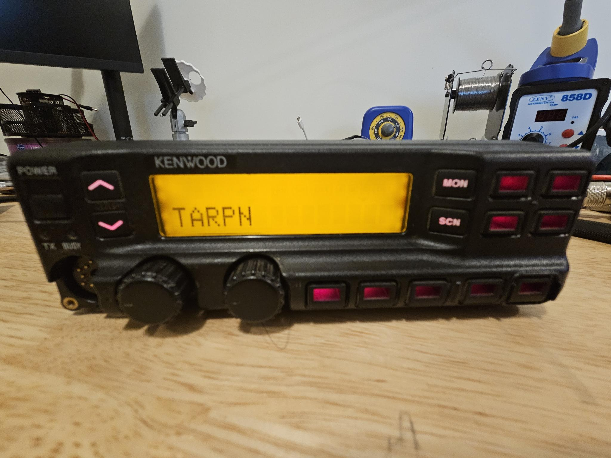
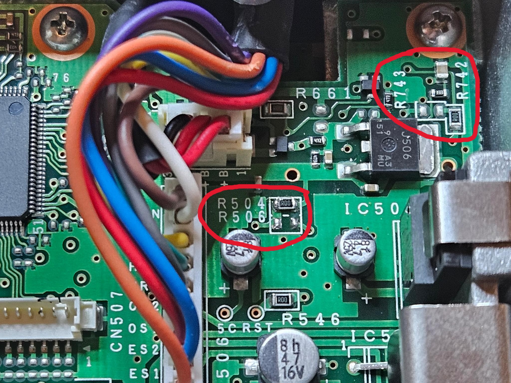
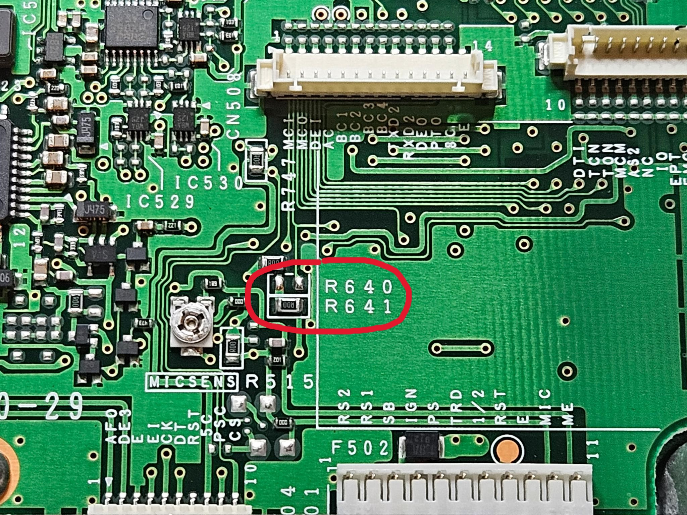
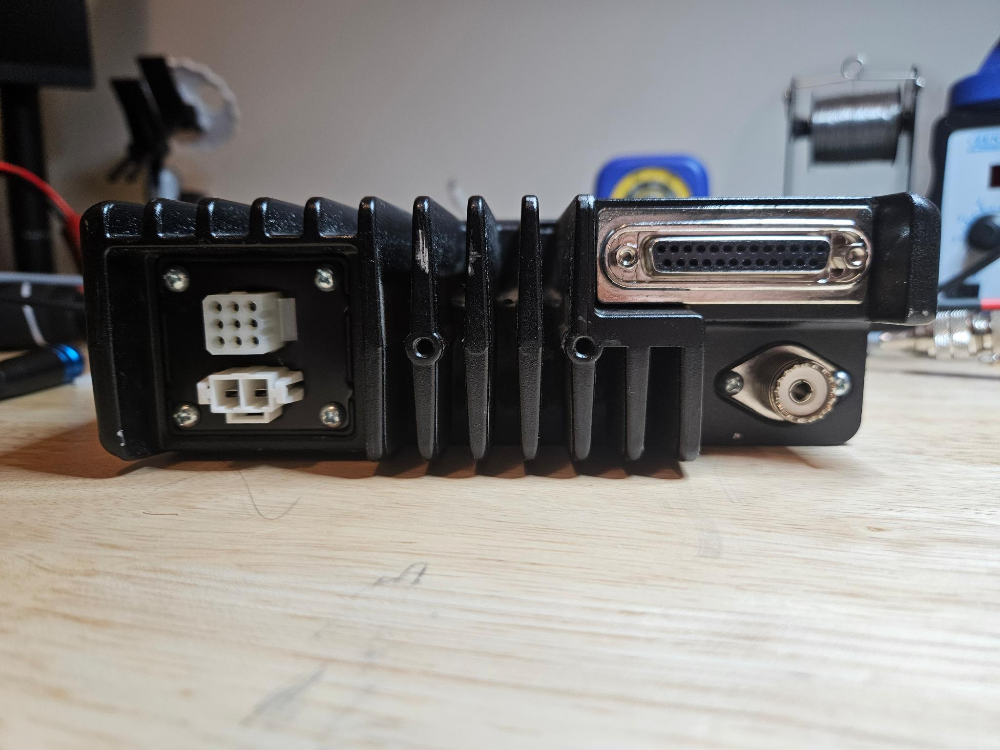
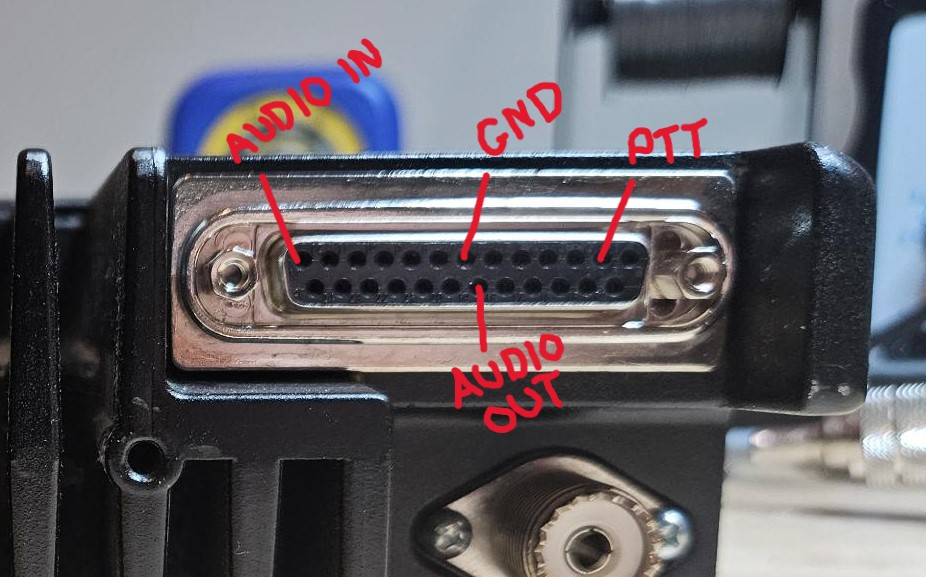

# Kenwood TK-790

### The TK-790 comes in a few different variants 

### 1. TK-790/(B) F1 [148-174Mhz] 45 Watt
### 2. TK-790(B) F2 [136-156Mhz] 45 Watt <- Rare
### 3. TK-790/(B) F1 [148-174Mhz] 110 Watt <- Uncommon

 ### Many of these radios will seem to not power on, usually they are setup for Ignition Sense for a mobile installation, If you adjust the Jumpers inside the top case as shown below, it will remove the requirement for Ignition Sense

 ### By Default the below jumpers should be set to allow Pin 13 on the 25-Pin Accessory terminal to accept ~10Khz of flat audio ~9.6kHz +1/–3dB (1kHz=0dB) (1kHz 2.5Vp-p input)

 ### On the rear of the Radio you will find a DB-25 accessory connector, a 9-Pin accessory connector, the OEM Power Connector and an SO-239 RF out. For Packet or TARPN use the DB-25 connector is of interest.

 ### Here's is Pinout of the DB-25 for Packet use. Pin 2 is a software defined pin that we will use as PTT

